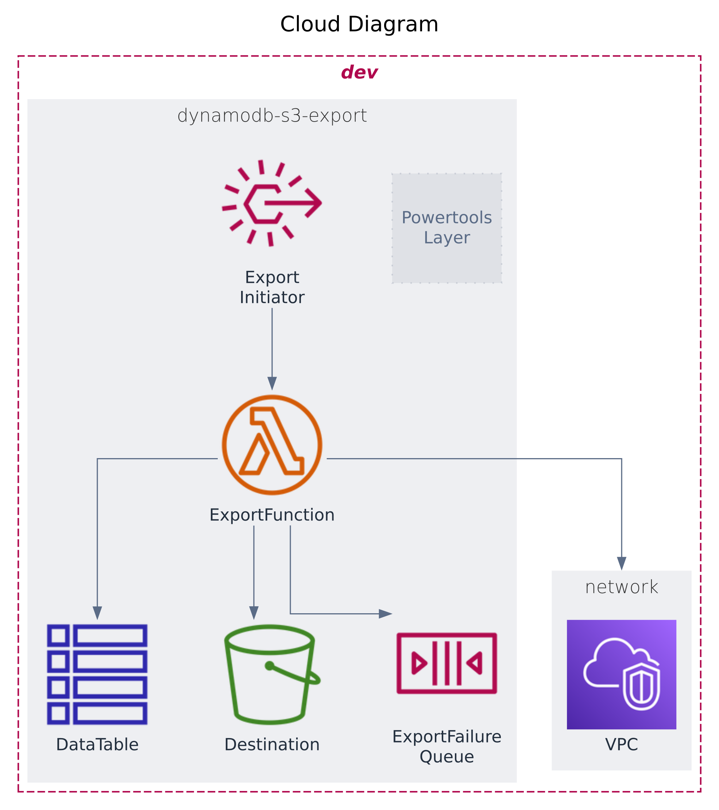

# Export data from DynamoDB Table to S3 Bucket
This is example repo which represents best-practice for exporting data from DynamoDB Table to S3 Bucket.

## Prerequisites
- AWS Account
- AWS CLI
- AWS CDK
- Node.js

## Installation
```bash
export AWS_PROFILE=your-profile
cdk bootstrap (if you haven't done it before)

npm install
projen build
projen deploy
```

## Solution


## Security
`GithubActionsStack` should be initialized in security repository.
